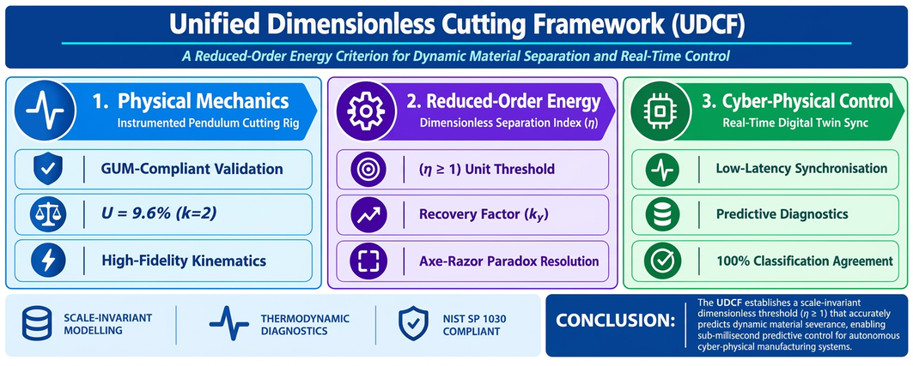

<div align="center">
  
  <p>
    <i><b>Graphical Abstract | The Unified Dimensionless Cutting Framework (UDCF).</b> An integrated approach combining (1) Physical Mechanics via instrumented validation, (2) Reduced-Order Energy criteria using the Dimensionless Separation Index (\(\eta\)), and (3) Cyber-Physical Control for real-time Digital Twin synchronisation.</i>
  </p>
</div>

---

# UDCF Research Tools: Unified Dimensionless Cutting Framework

[](https://doi.org/10.5281/zenodo.22112130)

This repository contains the official source code, statistical benchmark scripts, and raw experimental datasets for the **Unified Dimensionless Cutting Framework (UDCF)**. These tools support the **UDCF Profiler v3.1** , **Instrumented Pendulum Cutting Rig (IPCR) v3.1** and the UDCF Digital Twin v4.0 PRO**.

This package ensures full reproducibility of the results presented in the associated manuscript, covering Tables 2–5 and Figures 5, 6, 7, and 10.

## 📊 Project Overview
The Unified Dimensionless Cutting Framework (UDCF) utilizes a dimensionless separation index ($\eta$) to predict phenomenological outcomes (Severance vs. Deformation) across multi-scale cutting scenarios.

The core governing equation used in these tools is:

$$\eta = k_Y \left[ \frac{m \cdot v^2}{2 \cdot d \cdot t_{ult} \cdot A} \right]$$

To preserve dimensional homogeneity and physical fidelity, the parameter \(A\) is rigorously defined as the 2D projected area of the tool’s apex interface. Its value is determined by the interaction between the micro-scale edge radius \(r_e\) and the macro-scale effective contact length \(L_e\):

$$A = r_e \cdot L_e \cdot 10^{-9}$$


Where:
*   $m$ is mass
*   $v$ is velocity
*   $d$ is thickness
*   $t_{ult}$ is ultimate shear strength
*   $A$ is contact area
*   $k_Y$ is Systemic Energy Recovery Factor

## 📂 Repository Structure

### 📁 /data (Excel Datasets)
Contains the source data for all manuscript tables and figures:
- `raw_per_trial_table2.xlsx`: 5-trial repeat dataset for statistical validation.
- `extrapolation_100_trials.xlsx`: Comprehensive dataset (surgical scalpels to industrial shredders).
- `Figure_5_Source_Data.xlsx` to `Figure_10_Source_Data.xlsx`: Specific data points used for graphical plotting.

### 📁 /scripts (Python Analysis)
Python scripts to reproduce the statistical analysis and tables:
- `udcf_benchmark.py`: Core logic for calculating \(\eta\) across all trials.
- `udcf_stats_table2.py`: Generates the statistical "fingerprints" for Table 2.
- `table4_uncertainty.py`: Performs the uncertainty quantification for Table 4.
- `udcf_extrapolation_table5.py`: Models the extreme-scale scenarios for Table 5.

### 📁 /tools (Web Simulators)
Standalone HTML/JavaScript tools for real-time calculation:
- `udcf_profiler.html`: The primary interface for calculating the Separation Index.
- `udcf_ipcr.html`: Digital twin for the Instrumented Pendulum Cutting Rig.

  ## Figures and Experimental Results

<!-- Figure 1 -->
<div align="center">
  
  <p>
    <i><b>Figure 1 | The Axe-Razor Paradox: Visualising Scale-Dependent Energy Density Discrepancies.</b> (a) Macro-scale severance where mass-dominant kinetic energy overcomes the material's fracture toughness. (b) The micro-scale failure of a high-sharpness/low-mass implement; available kinetic energy (\(E_k\)) is insufficient to sustain the fracture front. (c) The UDCF addresses these discrepancies by defining an operational unit threshold at \(\eta \geq 1\).</i>
  </p>
</div>

---

<!-- Figure 2 -->
<div align="center">
  
  
  <p>
    <i><b>Figure 2 | Empirical Validation and Digital Twin Configuration.</b> (2A) Schematic of the Instrumented Pendulum Cutting Rig (IPCR). (2B) UDCF IPCR v3.1 (Digital Twin) simulator for real-time modelling. Available at: <a href="https://doi.org/10.5281/zenodo.2226243">https://doi.org/10.5281/zenodo.2226243</a>.</i>
  </p>
</div>

---

<!-- Figure 3 -->
<div align="center">
  
  <p>
    <i><b>Figure 3 | Schematic representation of the instantaneous contact area (A).</b> The area is defined by the tool edge radius (\(r_e\)) and effective contact length (\(L_e\)). Examples shown for: (a) Surgical scalpel, (b) Wood-cutting tool, and (c) Industrial insert.</i>
  </p>
</div>

---

<!-- Figure 4 -->
<div align="center">
  
  <p>
    <i><b>Figure 4 | Graphical User Interface (GUI) of the UDCF Profiler v3.1.</b> This interactive suite facilitates advanced impact data processing and real-time visualisation. Software archived at: <a href="https://doi.org/10.5281/zenodo.21346812">https://doi.org/10.5281/zenodo.21346812</a>.</i>
  </p>
</div>

---

<!-- Figure 5 -->
<div align="center">
  
  <p>
    <i><b>Figure 5 | Statistical Distribution and Variance of the Dimensionless Separation Index (\(\eta\)).</b> The bar chart visualises mean values across material categories. The critical threshold is marked at \(\eta=1.0\). (Source data: Figure_05_Source_Data.xlsx)</i>
  </p>
</div>

---

<!-- Figure 6 -->
<div align="center">
  
  <p>
    <i><b>Figure 6 | Stochastic Phase Transition and Efficiency Threshold.</b> Monte Carlo simulation results (n=500). Red points indicate sub-critical deformation; green points indicate successful cleavage. (Source data: Figure_06_Source_Data.xlsx)</i>
  </p>
</div>

---

<!-- Figure 7 -->
<div align="center">
  
  <p>
    <i><b>Figure 7 | Dimensionless Separation Index (\(\eta\)) Distribution Across Experimental Scenarios.</b> Blue bars indicate successful severance (\(\eta>1\)), while red bars indicate failure (\(\eta<1\)). (Source data: Figure_07_Source_Data.xlsx)</i>
  </p>
</div>

---

<!-- Figure 8 -->
<div align="center">
  
  <p>
    <i><b>Figure 8 | Computational Latency and Modelling Fidelity Benchmark.</b> Comparison between high-fidelity FEA (Abaqus) and the UDCF analytical profiler. (Visualisation generated via DALL·E 3 and refined by the author).</i>
  </p>
</div>

---

<!-- Figure 9 -->
<div align="center">
  
  <p>
    <i><b>Figure 9 | Conceptual Illustration of Autonomous Robotic Decommissioning.</b> Simulated control sequence demonstrating UDCF-enabled response to material transitions. (Visualisation generated via DALL·E 3 and refined by the author).</i>
  </p>
</div>

---

<!-- Figure 10 -->
<div align="center">
  
  <p>
    <i><b>Figure 10 | Theoretical Efficiency Mapping and Velocity-Dependent Threshold.</b> The curve illustrates the quadratic relationship between impact velocity (\(v\)) and the separation index (\(\eta\)). (Source data: Figure_10_Source_Data.xlsx)</i>
  </p>
</div>

## 🚀 Getting Started

### Prerequisites
- Python 3.8+
- Required Libraries: `pandas`, `numpy`, `matplotlib`

### Reproducing Results
To verify the statistical calculations for the manuscript, execute the scripts from the root directory:

```bash
# To reproduce Table 2 Statistics
python scripts/udcf_stats_table2.py

# To reproduce Table 4 Uncertainty Analysis
python scripts/table4_uncertainty.py

# To reproduce Table 5 Extrapolation
python scripts/udcf_extrapolation_table5.py

⚖️ License
This project is licensed under the MIT License - see the LICENSE file for details.

✉️ Contact
Clifford Yeboah
The Yeboah Institute Research Ghana
Email address: cliffordyeboah@yahoo.com
ORCID ID: https://orcid.org/0009-0000-9001-2643
